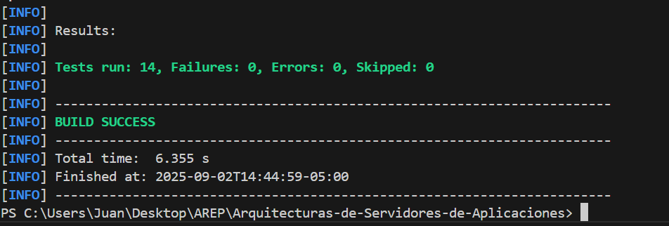

# MicroSpringBoot
## 📌 Description

This project implements a minimalist web server in Java, similar to Apache but simplified.
The server is capable of:

    * Serving static files (HTML, PNG images, etc.) from a public folder.
    * Exposing REST services built with annotated POJOs.  
    * Resolving dynamic routes using runtime reflection.
    * Handling query parameters with default values.
    * Handling multiple non-concurrent (sequential) requests.

This server constitutes a mini IoC framework called MicroSpringBoot, which allows building web applications using annotations such as @RestController, @GetMapping, and @RequestParam.

## Architecture

The project contains the following main packages:

### 📂 co.escuelaing.arep.microspringboot

    MicroSpringBoot.java → Main class that starts the server.

### 📂 co.escuelaing.arep.microspringboot.httpServer

    HttpServer.java → HTTP server in charge of:

    * Dynamically registering routes.
    * Handling GET requests.
    * Serving static files.

    HttpRequest.java → Parses the URL and query parameters (?x=10&y=5).

    HttpResponse.java → Manages headers and response content type.

### 📂 co.escuelaing.arep.microspringboot.annotations

    @RestController → Annotation to mark classes as REST controllers.

    @GetMapping → Annotation to map methods to HTTP GET routes.

    @RequestParam → Annotation to extract query parameters from the URL.

### 📂 co.escuelaing.arep.microspringboot.examples

    GreetingController.java → Example web application exposing the following endpoints:

        * /greeting?name=Juan → Returns a greeting.
        * /sum?x=5&y=7 → Returns the sum of two numbers.
        * /pi → Returns the value of π.

## ⚙️ Installation & Execution
Build the project
    mvn clean package

Run the server
    java -cp target/classes co.escuelaing.arep.microspringboot.MicroSpringBoot

The server will start at:
    http://localhost:8080

## 🌐 Example Endpoints
Method	    URI	            Description	                        Example Usage
GET	        /greeting	    Returns a greeting	                /greeting?name=Juan → Hello Juan
GET	        /sum	        Returns the sum of two integers	    /sum?x=10&y=5 → Result: 15
GET	        /pi	            Returns the value of PI	            /pi → 3.141592653589793

You can also serve static files from the webroot/public folder.
Example:

    http://localhost:8080/index.html
    http://localhost:8080/images/fondo.jpg
    http://localhost:8080/images/fondo.png

## 📑 Workshop Requirements & Compliance

    ✔ Apache-like Web Server in Java → Implemented in HttpServer.

    ✔ HTML and PNG file delivery → Supported in sendFileResponse.

    ✔ IoC Framework with annotated POJOs → Supported with @RestController, @GetMapping, @RequestParam.

    ✔ Handles multiple non-concurrent requests → Sequential use of ServerSocket.

    ✔ Minimal prototype with a loaded POJO → GreetingController.

    ✔ Automatic class scanning with annotations → Implemented in the final version of HttpServer.runServer().

## Test
 mvn test

## 👨‍💻 Author

    Juan David Rodríguez
    Academic project for the course Enterprise Architectures (AREP) – Escuela Colombiana de Ingeniería.